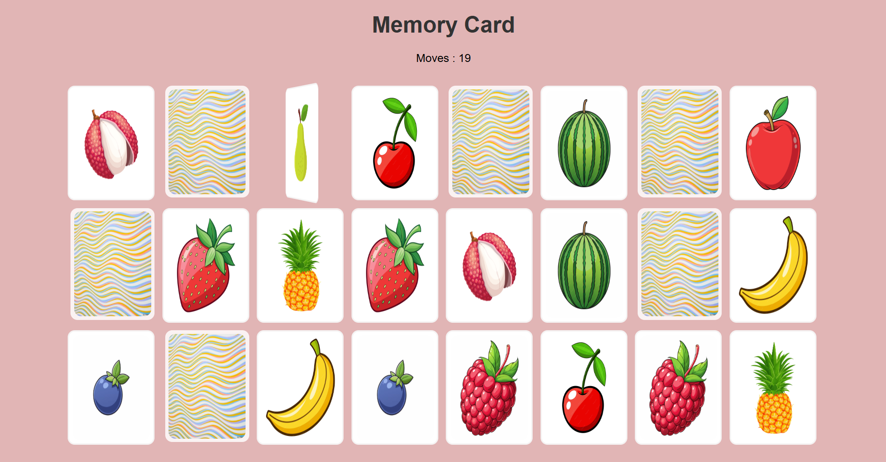

# Memory Card

A simple single-player Memory Card game with multiple difficulty levels.

---

## Rules
- Flip two cards at a time to find matching pairs.
- Match all pairs to win the level.
- Easy has 12 cards (6 pairs), Medium has 18 cards (9 pairs), Hard has 24 cards (12 pairs).
- Fewer moves = better score!

---

## How to Run
Open the corresponding HTML file in your browser:
- `Easy/Easy.html`
- `Medium/Medium.html`
- `Hard/Hard.html`

---

## Controls
- Click on a card to flip it.
- Match identical cards to keep them face up.
- The game tracks your moves and displays a win message when all pairs are matched.
- Has responsiveness across various screens

---

## Preview

Here’s how the game looks:



---

## Tech Stack
- HTML
- CSS
- JavaScript

---

## Files
```
MemoryCard/
├── assets/
│   ├── front-img.jpg
│   ├── img1.jpg
│   ├── img2.jpg
│   └── ...
├── Easy/
│   └── Easy.html
├── Medium/
│   └── Medium.html
├── Hard/
│   └── Hard.html
├── script.js
├── style.css
└── README.md
```
