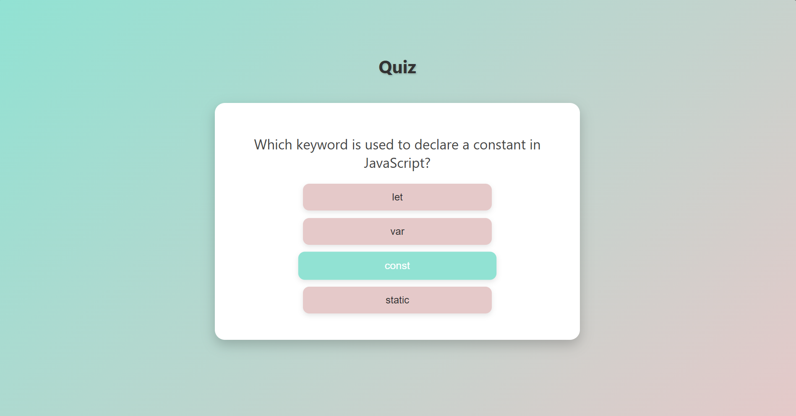

# Quiz App

A simple coding‑based quiz game where players answer multiple‑choice questions.  
Each question tests your programming knowledge, and your score is shown at the end.

---

## Rules

- Read the question carefully.
- Click on the correct answer from the given options.
- Each correct answer adds 1 point to your score.
- The quiz automatically moves to the next question.
- Final score is displayed after all questions are answered.

---

## How to Run

Open `index.html` in your browser to start the quiz.

---

## Controls

- Click on an option to select your answer.
- The next question appears automatically.
- At the end, your total score is displayed.

---

## Preview

Here’s how the game looks:



---

## Tech Stack

- HTML  
- CSS  
- JavaScript  

---

## Files

```
quiz-app/
├── index.html
├── style.css
├── quiz.js
└── README.md
```
