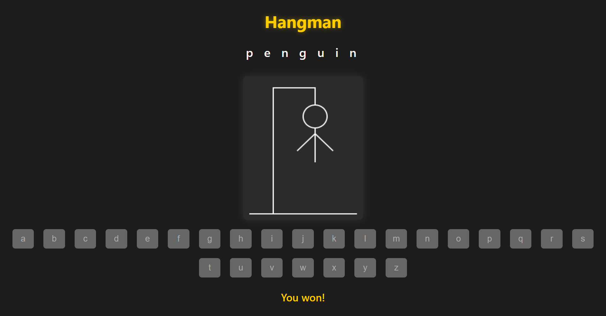

# Hangman

A classic word‑guessing game where the player tries to guess a hidden word by selecting letters from an on‑screen keyboard.  
Each wrong guess draws part of the hangman figure. Player should guess the word before the figure is complete!

---

## Rules

- The computer randomly selects a word from an array or can select by using API method
- The player clicks letters on the keyboard to guess.
- Correct guesses reveal letters in the word.
- Wrong guesses draw parts of the hangman (head, body, arms, legs).
- The player wins by guessing all letters before the hangman is fully drawn.
- The game ends in defeat if the hangman is completed.

---

## How to Run

Open `index.html` in your browser to play.

---

## Controls

- Click on any letter in the on‑screen keyboard to make a guess.
- Correct letters appear in the word display.
- Wrong guesses add parts to the hangman drawing.
- The game displays a win or lose message when finished.

---

## Preview

Here’s how the game looks:



---

## Tech Stack

- HTML
- CSS
- JavaScript (Canvas for drawing)

---

## Files
```
hangman/
├── index.html
├── style.css
├── script.js
└── README.md
```
