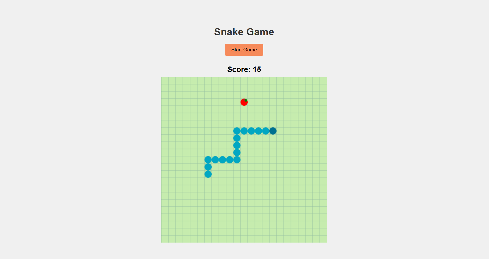

# Snake Game

A classic snake game where the player controls a snake that moves around the grid, eats apples to grow longer, and avoids colliding with walls or itself.  
The goal is to achieve the highest score possible before the snake crashes!

---

## Rules

- Use arrow keys to control the snake’s direction.
- The snake moves continuously once the game starts.
- Eating an apple increases the score and makes the snake longer.
- The game ends if the snake hits the wall or collides with itself.
- A "Game Over" box appears inside the canvas with a restart option.

---

## How to Run

Open `index.html` in your browser and click **Start Game** to begin.

---

## Controls

- **Arrow Keys** → Move the snake (Up, Down, Left, Right).
- **Start Button** → Begin the game.
- **Restart Button** → Restart after Game Over.

---

## Preview

Here’s how the game looks:



---

## Tech Stack

- HTML
- CSS
- JavaScript (Canvas for drawing)

---

## Files
```
snake-game/
├── index.html
├── style.css
├── script.js
└── README.md
```
