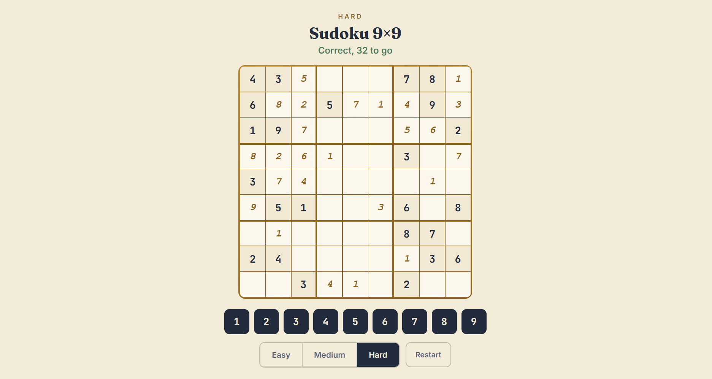

# Sudoku 4×4

A fun and interactive Sudoku puzzle played on a 9x9 grid.

---

## Rules

- Fill the grid so that each **row**, **column**, and **3×3 box** contains all numbers from **1 to 9**.  
- Some cells are given as clues at the start.  
- Wrong entries are highlighted, but you can erase and try again.  
- The puzzle is solved when all cells are filled correctly.  
- You can restart or change difficulty to generate a new puzzle with random clues.

---

## How to Run

Open `index.html` in your browser to play.

---

## Controls

- Click on a cell to select it.  
- Use the number buttons (1–9) or your keyboard to enter a value.  
- Press **Backspace/Delete** to erase a number.  
- Use the **Restart** button to reset the current puzzle.  
- Switch between **Easy** (36 clues), **Medium** (30 clues) and **Hard** (24 clues) using the difficulty toggle.  

---

## Preview

Here’s how the game looks:



---

## Features

- Random clue generation on each restart or difficulty change.  
- Difficulty toggle (**Easy** vs **Medium** vs **Hard**) with different clue counts.  
- Wrong number highlighting for quick feedback.  
- Clean UI with styled grid and box borders.  
- Keyboard support for faster play.  

---

## Tech Stack

- HTML  
- CSS  
- JavaScript  

---

## Files

```
sudoku-9x9/
├── index.html
├── style.css
├── script.js
└── README.md
```